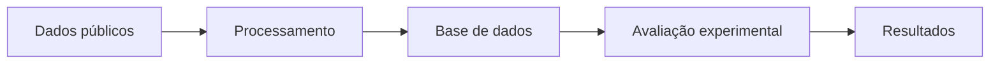
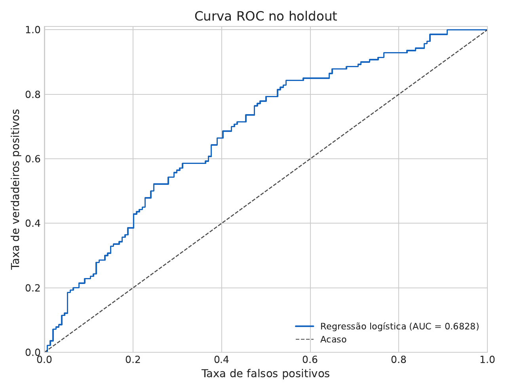
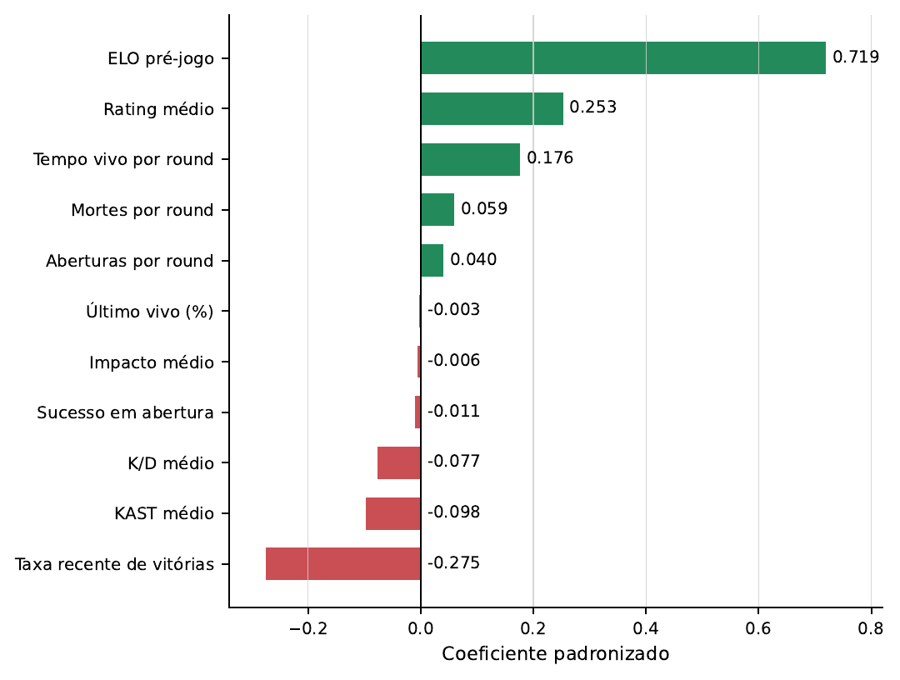
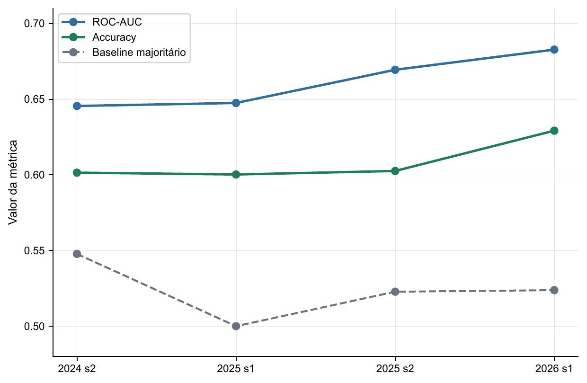

# Predição pré-jogo de partidas profissionais de CS2

[](https://www.python.org/)
[](https://github.com/ceegu1N/cs2-pre-match-prediction/actions/workflows/tests.yml)
[](LICENSE)
[](docs/tcc_gabriel_herdy_rocha.pdf)

Projeto de Engenharia de Computação que organiza dados públicos anteriores às partidas, constrói diferenças entre equipes e compara classificadores para estimar probabilidades de vitória em confrontos profissionais de *Counter-Strike 2*.

O modelo final é uma regressão logística L2 com 11 variáveis. No *holdout* temporal de 294 partidas, obteve **ROC-AUC de 0,6828** e **acurácia de 0,6293**, contra **0,5238** da regra que sempre escolhe a classe majoritária. O resultado indica sinal preditivo moderado no recorte estudado; não representa garantia de acerto.

> **English summary:** Reproducible pre-match CS2 prediction pipeline based on public historical data, temporally separated evaluation and an interpretable L2 logistic regression model. Raw third-party data and automated collectors are not redistributed.

## Visão geral



O fluxo desenvolvido cobre:

- preparação e validação da estrutura dos dados;
- construção de atributos pré-jogo como diferenças entre duas equipes;
- cálculo de ELO anterior à partida e agregação de estatísticas dos jogadores;
- seleção de atributos e comparação de classificadores sob o mesmo protocolo;
- separação temporal entre treinamento/seleção e *holdout*;
- exportação do modelo, configurações e resultados agregados.

## Resultado principal

| Elemento | Valor |
|---|---:|
| Partidas válidas | 2.840 |
| Atributos pré-jogo construídos | 38 |
| Treinamento e seleção | 2.546 partidas |
| *Holdout* temporal (`2026_s1`) | 294 partidas |
| Configuração final | `univariate_top_11__logreg_l2_c0.3_cwnone` |
| ROC-AUC no *holdout* | 0,6828 |
| Acurácia no *holdout* | 0,6293 |
| Acurácia da classe majoritária | 0,5238 |

A regressão logística foi mantida por combinar desempenho competitivo, probabilidades diretas, coeficientes interpretáveis e reprodução simples. O SVM linear alcançou o mesmo ROC-AUC no *holdout*, portanto a escolha não é apresentada como uma vitória folgada de um algoritmo sobre o outro.



## Modelo final

O artefato em [`models/logistic_regression.joblib`](models/logistic_regression.joblib) é um `Pipeline` do scikit-learn com imputação, normalização *z-score* e regressão logística. Sua configuração congelada é:

- penalização L2;
- `C = 0.3`;
- `class_weight = None`;
- limiar de decisão padrão de 0,5;
- 11 atributos de força histórica, forma recente e desempenho dos jogadores.

As entradas são diferenças entre a equipe analisada e o adversário na mesma data. Uma diferença positiva favorece o primeiro lado da comparação; uma diferença negativa favorece o segundo. O dicionário das 11 entradas está em [`data/schema/final_model_features.csv`](data/schema/final_model_features.csv).



Os coeficientes mostram contribuições condicionais às demais variáveis, não relações causais. Como parte dos indicadores é correlacionada, o sinal de um peso isolado não deve ser interpretado como efeito independente sobre a vitória.

## Separação temporal

As partidas de `2024_s1` a `2025_s2` foram usadas no treinamento e na seleção. A janela posterior `2026_s1` foi reservada para a comparação final dos candidatos já definidos. Essa organização reduz o risco de avaliar o modelo com informações posteriores às partidas representadas.

A validação temporal bloqueada foi usada como verificação complementar: o treinamento avança por janelas antigas e a avaliação ocorre sempre na janela seguinte. O ROC-AUC permaneceu entre 0,646 e 0,683 nas quatro divisões documentadas.



## Demonstração local

Os nomes e valores da demonstração são **inteiramente sintéticos**. Eles servem apenas para conferir o formato das entradas e executar o artefato final sem redistribuir dados da fonte original.

### Windows PowerShell

```powershell
python -m venv .venv
.\.venv\Scripts\Activate.ps1
python -m pip install -r requirements.txt
python predict_match.py --team-a equipe-aurora --team-b equipe-horizonte
```

### Linux ou macOS

```bash
python3 -m venv .venv
source .venv/bin/activate
python -m pip install -r requirements.txt
python predict_match.py --team-a equipe-aurora --team-b equipe-horizonte
```

A demonstração também possui interface gráfica:

```powershell
python predict_match_gui.pyw
```

O resultado exibido é a aplicação do modelo treinado às diferenças fictícias. Ele não é uma previsão de uma partida real.

## Estrutura do repositório

```text
.
|-- data/
|   |-- sample/               # duas equipes fictícias para demonstração
|   `-- schema/               # dicionários das entradas
|-- docs/                     # monografia e figuras
|-- models/                   # modelo final, lista de atributos e registro
|-- reports/                  # configurações e resultados agregados
|-- src/                      # construção de variáveis e bateria experimental
|-- tests/                    # testes funcionais e de política de publicação
|-- build_datasets.py
|-- run_experimental_battery.py
|-- train_model.py
`-- predict_match.py
```

Os scripts de treinamento e avaliação esperam bases compatíveis com os esquemas do projeto. Como os dados reais não são publicados, a reconstrução integral dos experimentos requer que o interessado obtenha legitimamente seus próprios dados e os adapte ao formato documentado.

## Evidências publicadas

- configuração congelada: [`reports/modelo_principal/config_modelo_principal.json`](reports/modelo_principal/config_modelo_principal.json);
- resumo do modelo: [`reports/modelo_principal/resumo_modelo_principal.json`](reports/modelo_principal/resumo_modelo_principal.json);
- métricas finais: [`reports/tables/model_metrics.csv`](reports/tables/model_metrics.csv);
- coeficientes: [`reports/tables/logistic_coefficients.csv`](reports/tables/logistic_coefficients.csv);
- validação temporal: [`reports/validacao_temporal_bloqueada/`](reports/validacao_temporal_bloqueada/);
- avaliação prospectiva agregada: [`reports/prospectiva/`](reports/prospectiva/);
- monografia: [`docs/tcc_gabriel_herdy_rocha.pdf`](docs/tcc_gabriel_herdy_rocha.pdf).

A avaliação prospectiva reúne três eventos posteriores e é apresentada apenas como verificação complementar. Ela não substitui o *holdout* usado no resultado principal.

## Origem e disponibilidade dos dados

O desenvolvimento utilizou informações públicas disponíveis na HLTV.org. Os dados brutos e os coletores automatizados não são redistribuídos neste repositório, em respeito aos termos atuais da fonte, que restringem atividades de mineração de dados e *web scraping*. Para permitir a compreensão e a execução do fluxo, são disponibilizados o esquema dos dados, uma amostra sintética e os códigos de processamento, treinamento, avaliação e inferência.

Consulte [`DATA_NOTICE.md`](DATA_NOTICE.md) para o escopo completo. Dúvidas acadêmicas sobre a metodologia e a reprodução com dados obtidos legitimamente podem ser encaminhadas ao autor pelo perfil [@ceegu1N](https://github.com/ceegu1N). Os dados brutos e os coletores não são fornecidos mediante contato.

## Limitações

- dependência de informações públicas e da consistência histórica da fonte;
- recorte concentrado nas 50 equipes mais bem posicionadas por janela;
- ausência de mapas, vetos e decisões táticas específicas da série;
- mudanças de elenco nem sempre representadas imediatamente;
- ausência de comparação com *odds* de mercado;
- desempenho variável conforme o contexto e a diferença de força entre equipes.

## Autoria e contexto acadêmico

Desenvolvido por **Gabriel Herdy Rocha** como Trabalho de Conclusão de Curso em Engenharia de Computação na Universidade Federal de São Carlos (UFSCar), sob orientação do Prof. Dr. André Ricardo Backes.

O código autoral é disponibilizado sob a [licença MIT](LICENSE). Para citar o software, use os metadados de [`CITATION.cff`](CITATION.cff). O PDF da monografia permanece um documento acadêmico e não é coberto pela licença do código.
